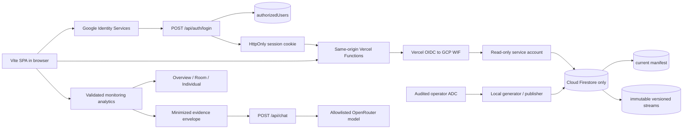

# Architecture

## System map



Vercel owns web hosting, routing, sessions, APIs, and the AI gateway. Firebase
owns only the Firestore database and its deny-all client rules. Runtime reads
use IAM through short-lived OIDC federation; administrative writes use a
separate operator identity.

## Authorization boundary

The access gate loads Google Identity Services from `accounts.google.com`.
`POST /api/auth/login` verifies the GIS double-submit CSRF value, Google token
signature, issuer, audience, expiry, email, and verified-email claim. It hashes
the normalized email and reads `authorizedUsers/{hash}`. Only an enabled
`clinician` or `admin` entry receives a signed `__Host-sentinel_session` cookie.

The session is HS256, expires within eight hours, and is stored only as an
HttpOnly, Secure, SameSite=Strict browser-session cookie. APIs reject missing,
expired, malformed, or wrong-role sessions. Logout clears the cookie.

Firestore Rules are deliberately not an end-user authorization layer: every
client read and write is denied. Server-side IAM is the only runtime Firestore
boundary. The Vercel service account has `roles/datastore.viewer`; it cannot
publish data or alter the allowlist.

## Monitoring data flow

The current manifest has this public API representation:

```json
{
  "version": "demo-2026-07-28",
  "schemaVersion": 2,
  "dataClassification": "synthetic",
  "publishedAt": "2026-07-28T00:00:00.000Z"
}
```

The browser reads `/api/manifest`, then pages through
`/api/monitoring?stream=students|logs|assessments&version=...&pageToken=...`.
Fixed page sizes are 250 students, 1,000 logs, and 250 assessments. Before
making data visible, the adapter reads the manifest again. A changed manifest
or `409 dataset-version-changed` discards the buffered candidate and restarts
from the new version. This prevents a mixed-generation dashboard without
requiring live Firestore listeners.

Data is loaded when the dashboard opens and when the user explicitly refreshes.
There is no polling or background subscription. API responses use
`Cache-Control: private, no-store`.

Schema v2 changes relevant to analytics:

- `self`, `buddy`, `command`, and `physicalInjury` are nullable, but a log must
  contain at least one observed value. `selfObservedAt` is an ISO timestamp when
  Self is present.
- DASS-D/A/S are raw integers from 0 through 21. CD-RISC is 0–40 and GRIT is
  0–32.
- Only observed values contribute to mean, sample SD, and N. LOCF is limited to
  labeled Self/Buddy/Command presentation; physical injury is never carried.
- Room Status begins at the latest date represented by the dataset and retains
  each channel's source date and carried-forward marker.

## Synthetic publication flow

The local workbook tool validates the five expected sheets and headers. Numeric
IDs normalize to strings; duplicate Daily Self keys retain the latest optional
timestamp or, when no timestamp exists, the last file row. Buddy zero becomes
missing. Weekly Command lookup values are ignored in favor of the hidden
`Command` sheet. Cross-source week mismatches are quarantined and reported.

Only aggregate distributions, missingness, counts, and quality totals reach the
profile. A seeded PRNG produces unrelated `demo-*` identities, generic names
and rooms, shifted dates, and independently sampled observations. No source row
or person-level trajectory is written to the repository or generated output.

The publisher validates schema v2, `dataClassification: synthetic`, generic
identities, score ranges, and references. Dry-run is the default. With
`--commit`, it writes a new immutable version in batches and switches
`monitoringManifests/current` last. A failed batch leaves the current manifest
unchanged.

## Sentinel Analyst

The browser sends the existing bounded, alias-based evidence contract to
`POST /api/chat` with the session cookie. The Vercel function repeats role and
dataset checks, applies body and rate limits, enforces roster redaction and the
privacy budget, and keeps deterministic evidence-only routes local. Only
question-specific minimized evidence can reach an allowlisted OpenRouter model
under Zero Data Retention routing. Provider output remains untrusted and is
schema-checked before display.

## Deployment topology

`vercel.json` builds `dist`, runs Functions in `sin1`, enables Fluid Compute,
allows 90 seconds for chat and 15 seconds for other APIs, applies browser
security headers, and sends non-API deep links to `index.html`. Preview
deployments use Vercel Standard Protection and have no production Firestore IAM
binding. Only the production OIDC subject may impersonate the runtime reader.
