# Architecture

## System map

```mermaid
flowchart LR
  User["Staff browser"] --> Auth["Auth Module"]
  Auth -->|"unauthorized"| Gate["Access Gate"]
  Auth -->|"verified clinician/admin"| Shell["Lazy Dashboard shell"]
  Shell --> Data["Monitoring Data Module"]
  Data --> Adapter["Firebase Adapter"]
  Adapter --> Rules["Firestore Security Rules"]
  Rules --> Manifest[("current dataset manifest")]
  Manifest --> Store[("versioned students / logs / assessments")]
  Adapter --> Verify["Server snapshot gate"]
  Verify --> Decode["Manifest and record decoders"]
  Decode --> Coordinate["Versioned dataset coordinator"]
  Coordinate --> Lifecycle["Atomic shared lifecycle store"]
  Lifecycle --> Analytics["Monitoring Analytics Module"]
  Analytics --> Overview["Overview screen"]
  Analytics --> Room["Room Status screen"]
  Analytics --> Individual["Individual screen"]
  Analytics --> Evidence["Alias-only evidence envelope"]
  Evidence --> Function["Authenticated privacy gateway"]
  Function --> Roster["Current manifest / roster check"]
  Roster --> Policy["Evidence policy / deterministic analytics"]
  Policy -->|"synthesis required"| Model["Allowlisted OpenRouter model / ZDR"]
  Policy -->|"exact evidence answer"| Function
  Model --> Function
  Function --> Chat["Validated text / table / chart"]
```

The composition direction is one-way. Screens know the analytics Interface,
not Firestore. Firestore snapshots must pass through decoding and lifecycle
state before they reach analytics.

## Design vocabulary

- **Module** — a cohesive owner of behavior and invariants. The main Modules
  are authorization, monitoring data, monitoring analytics, and each workflow
  screen.
- **Interface** — the small public surface used by the next layer. Examples are
  `useMonitoringData()` and `createMonitoringAnalytics(...).getOverview(...)`.
- **Seam** — a deliberate substitution point. The monitoring store accepts an
  Adapter, so tests can use the in-memory implementation without Firebase.
- **Adapter** — infrastructure translation at a boundary. The Firebase Adapter
  turns a verified manifest and bounded Firestore snapshots into one versioned
  dataset event.
- **Depth** — substantial behavior behind a small Interface. Validation,
  lifecycle, truncation, freshness, error handling, and cleanup stay behind the
  data Module rather than leaking into React.
- **Locality** — code and state live with the workflow that changes them.
  Gender, date, and selected-student state belong to their respective screens.
- **Leverage** — one invariant protects multiple consumers. Central decoding
  and analytics rules protect all three screens and their future variants.

## Runtime boundaries

### Authorization Module

`App.jsx` observes Firebase ID-token changes. Until the token is verified and
contains an allowed `sentinelRole`, only the access gate is rendered. The
dashboard and Firestore code are loaded lazily after authorization.

Firebase configuration has no repository fallback. Vite and the runtime both
validate required values. The actual Vite development-server command is forced
onto fixed localhost Auth and Firestore emulators; freely selectable mode names
are not trusted for this decision. ConfigEnv `command` and `isPreview` form the
classification Seam, while every remote mode requires App Check configuration.
Auth is initialized with browser-session persistence rather than the Firebase
web default, so a privileged sign-in is not retained after its tab or browser
session closes.

Client-side authorization improves UX but is not trusted. `firestore.rules`
repeats the role and verified-email check and denies all client writes.

### Monitoring Data Module

`useMonitoringData()` subscribes to a single shared store. On the first
subscriber the store connects the Firebase Adapter; on the last unsubscribe it
disconnects every listener and clears sensitive records from its snapshot.

The Adapter first reads the exact `monitoringManifests/current` document. Its
safe version selects `students`, `logs`, and `assessments` collections below
`monitoringDatasets/{version}`. Security Rules allow only that current version,
so staged, retired, top-level legacy, and undeclared paths fail closed.

Each selected collection has a hard query limit plus one sentinel record. If
the sentinel appears, the stream is marked truncated. Snapshot records are
decoded using strict types, safe identifiers, valid dates, known score ranges,
and known fields. Any issue moves the public state to `degraded`; stream
failures move it to `error`. Both states pause presentation of analytics.

After all three streams load, the data Module checks referential integrity.
Every log and assessment must reference a student in the same dataset; orphan
records degrade the complete dataset rather than disappearing inside analytics.

The Firebase Adapter requests metadata events and accepts only manifest and
record snapshots whose `fromCache` and `hasPendingWrites` values are explicitly
`false`. Cache-only snapshots and latency-compensated local-write overlays are
neither decoded nor timestamped. Every listener must receive its first
committed server-confirmed snapshot within 15 seconds; otherwise the state
fails closed. A later unverified transition immediately moves the state to
`error`, and a subsequent identical committed snapshot can recover it.

The versioned dataset coordinator buffers all three streams behind a narrow
Interface. It publishes one atomic replacement only after the complete version
is verified. A manifest transition clears the previous sensitive version while
the next one connects. A changed snapshot under an already-published version
violates the immutable-version contract and fails closed until a manifest
transition. This Module has high Depth: independent listeners, generation
tokens, mutation detection, and recovery remain behind one dataset event.

`lastUpdatedAt` is the time the complete dataset was published after all three
streams were server-confirmed. It is point-in-time evidence, not an independent
connection heartbeat and not the age of the underlying clinical observations.
The in-memory Adapter, coordinator, and verified subscriptions are test Seams
for lifecycle behavior with strong Locality and reusable Leverage.

### Monitoring Analytics Module

`createMonitoringAnalytics()` owns all domain transformations:

- deterministic duplicate resolution;
- per-student chronological LOCF for labeled presentation continuity only;
- observed-value population statistics and latest-observation alerts;
- an explicit local-date as-of cutoff that withholds future-dated logs;
- equally weighted per-student weekly means with per-metric sample size and
  sample standard deviation only when at least two students contribute;
- scheduled DASS-21, CD-RISC, and GRIT projections;
- per-instrument latest selection with the source week retained;
- historical room views that never use a future assessment;
- individual interpretation labels.

It returns projections rather than raw storage queries. Screens do not
reimplement domain rules.

### Workflow screens

Overview, Room Status, and Individual are independent Modules with local state.
Recharts and each screen are dynamically imported. Hovering or focusing a
navigation item preloads that workflow, while initial unauthenticated users do
not download Firestore or chart code.

Screen error boundaries replace failed output with a generic safe message and
never reflect exception details into the rendered UI. React root handlers log
only a fixed failure category, never the exception or component stack.
Room and individual workflows label every carried-forward Buddy or Command
value with its source date so presentation continuity cannot be mistaken for a
new observation.

### Sentinel Analyst Module

The authorized dashboard lazily loads the floating assistant. Its evidence
builder consumes the same Monitoring Analytics Interface and verified records
as the workflow screens. It resolves names and rooms locally, assigns aliases
that exist only for the current conversation, and emits only allowlisted
numbers, dates, weeks, coverage, and alias references. Aggregate series require
at least five contributors. Rankings contain at most five aliases, comparisons
at most three, and free-text notes and raw profiles are never part of evidence.
Future-dated observations remain withheld.

Prediction requests use a deterministic, bounded ordinary-least-squares trend
computed in the browser from verified points. The Function validates and
renders supplied forecast points without asking the model to recalculate or
qualitatively grade their magnitude. This is exploratory decision support, not
clinical diagnosis.

The browser never receives the OpenRouter key. It sends a Firebase ID token,
App Check token, a redacted current utterance, enumerated semantic state with no
free-form history, and a strict evidence envelope to the same-origin `/api/chat`
Function.
The Function repeats verified-email and exact-role authorization, checks the
requested model against the six-model allowlist, and applies separate
per-instance endpoint and provider request limits. Local-only answers consume
only the broader endpoint bucket. It rejects unknown fields and the former arbitrary conversation
and context blobs, verifies the current dataset manifest, loads only the bounded
current student roster, redacts any remaining known name, ID, or room, then
builds a provider request from the intent, allowlisted state fields, and numeric
evidence only. It omits the natural-language utterance, prior free-form turns,
dataset label, and evidence ID; remaps browser aliases to provider-only aliases;
and scans the final body against the authoritative roster before egress. Only
then does it call the selected OpenRouter model with ZDR routing and the
structured-response schema. No stable user identifier is forwarded to the
provider. Before provider egress, the Function recognizes exact lookups,
counts, comparisons, window means, rankings, trends, supplied or unavailable
forecasts, and requests for unsupported causal explanations that can be
answered safely from verified numbers alone. Those routes return a canonical
response locally with zero provider bytes. Historical narrative synthesis sends
only server-derived first/last/min/max, mean/change/slope and point counts, not
weekly points. Provider-routed responses are schema-normalized, checked against
the disclosed numeric facts, and aligned against canonical artifacts; tables,
charts, ranking order, forecast artifacts, response status, and limitations are
corrected deterministically before display. A slow or invalid provider response
falls back to a visibly labeled evidence-only answer, except HTTP 402, which is
returned unchanged. The Function reverses its
provider-only alias mapping, then React restores display names locally and
shows an expandable disclosure receipt. The receipt derives its reference
manifest from the actual minimized provider message for remote synthesis and
from the verified evidence envelope for local-only computation, so it can
distinguish raw time points from server-derived statistics without exposing
omitted identifiers. UI
history, semantic state, alias maps, and the small evidence cache stay in memory
and clear together on reset, sign-out, dataset rollover, readiness loss, or page
close.

## Dependency rules

1. `auth/` may depend on Firebase Auth and shared config, never Firestore.
2. `data/` may depend on decoders and an infrastructure Adapter, never screens.
3. `domain/` stays framework- and Firebase-free.
4. `screens/` consume the analytics Interface and loading state, never raw
   snapshots or Firebase SDKs.
5. `App.jsx` is the authorization composition root; `Dashboard.jsx` is the
   authorized workflow composition root.
6. `chat/` may consume analytics and authenticated public Interfaces, while the
   server Function owns provider credentials and repeats authorization.

These rules preserve Depth and Locality. New data sources should implement the
Adapter Seam; new presentation variants should consume existing analytics
projections or extend that Module with a tested domain operation.

## Decision records

- [ADR 0001: privileged read-only access](adr/0001-privileged-read-only-access.md)
- [ADR 0002: validate at the data boundary](adr/0002-validate-at-data-boundary.md)
- [ADR 0003: bounded shared data lifecycle](adr/0003-bounded-shared-data-lifecycle.md)
- [ADR 0004: central monitoring analytics](adr/0004-central-monitoring-analytics.md)
- [ADR 0005: clinical browser data scope](adr/0005-clinical-browser-data-scope.md)
- [ADR 0006: explicit Firebase environments](adr/0006-explicit-firebase-environments.md)
- [ADR 0007: manifest-pinned atomic datasets](adr/0007-manifest-pinned-atomic-datasets.md)
