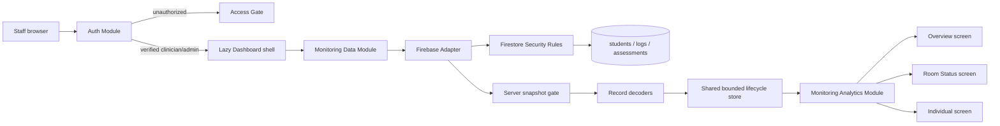

# Architecture

## System map

The composition direction is one-way. Screens know the analytics Interface,
not Firestore. Firestore snapshots must pass through decoding and lifecycle
state before they reach analytics.

## Design vocabulary

- **Module** — a cohesive owner of behavior and invariants. The main Modules
  are authorization, monitoring data, monitoring analytics, and each workflow
  screen.
- **Interface** — the small public surface used by the next layer. Examples are
  `useMonitoringData()` and `createMonitoringAnalytics(...).getOverview(...)`.
- **Seam** — a deliberate substitution point. The monitoring store accepts an
  Adapter, so tests can use the in-memory implementation without Firebase.
- **Adapter** — infrastructure translation at a boundary. The Firebase Adapter
  turns bounded Firestore snapshots into decoded stream events.
- **Depth** — substantial behavior behind a small Interface. Validation,
  lifecycle, truncation, freshness, error handling, and cleanup stay behind the
  data Module rather than leaking into React.
- **Locality** — code and state live with the workflow that changes them.
  Gender, date, and selected-student state belong to their respective screens.
- **Leverage** — one invariant protects multiple consumers. Central decoding
  and analytics rules protect all three screens and their future variants.

## Runtime boundaries

### Authorization Module

`App.jsx` observes Firebase ID-token changes. Until the token is verified and
contains an allowed `sentinelRole`, only the access gate is rendered. The
dashboard and Firestore code are loaded lazily after authorization.

Firebase configuration has no repository fallback. Vite and the runtime both
validate required values. Development mode is forced onto fixed localhost Auth
and Firestore emulators; every remote mode requires App Check configuration.
Auth is initialized with browser-session persistence rather than the Firebase
web default, so a privileged sign-in is not retained after its tab or browser
session closes.

Client-side authorization improves UX but is not trusted. `firestore.rules`
repeats the role and verified-email check and denies all client writes.

### Monitoring Data Module

`useMonitoringData()` subscribes to a single shared store. On the first
subscriber the store connects the Firebase Adapter; on the last unsubscribe it
disconnects every listener and clears sensitive records from its snapshot.

Each collection has a hard query limit plus one sentinel record. If the
sentinel appears, the stream is marked truncated. Snapshot records are decoded
using strict types, safe identifiers, valid dates, known score ranges, and
known fields. Any issue moves the public state to `degraded`; stream failures
move it to `error`. Both states pause presentation of analytics.

The Firebase Adapter requests metadata events and accepts only snapshots whose
`fromCache` and `hasPendingWrites` values are explicitly `false`. Cache-only
snapshots and latency-compensated local-write overlays are neither decoded nor
timestamped. Every stream must receive its first committed server-confirmed
snapshot within 15 seconds; otherwise the state fails closed. A later
unverified transition immediately moves the state to `error`, and a subsequent
committed server snapshot can recover it.

`lastUpdatedAt` is the time the accepted snapshot was confirmed by the server.
It is point-in-time evidence, not an independent connection heartbeat and not
the age of the underlying clinical observations. The in-memory Adapter and the
verified-query subscription are test Seams for lifecycle behavior.

### Monitoring Analytics Module

`createMonitoringAnalytics()` owns all domain transformations:

- deterministic duplicate resolution;
- per-student chronological LOCF for labeled presentation continuity only;
- observed-value population statistics and latest-observation alerts;
- an explicit local-date as-of cutoff that withholds future-dated logs;
- sample mean and sample standard deviation;
- scheduled DASS-21, CD-RISC, and GRIT projections;
- historical room views that never use a future assessment;
- individual interpretation labels.

It returns projections rather than raw storage queries. Screens do not
reimplement domain rules.

### Workflow screens

Overview, Room Status, and Individual are independent Modules with local state.
Recharts and each screen are dynamically imported. Hovering or focusing a
navigation item preloads that workflow, while initial unauthenticated users do
not download Firestore or chart code.

Screen error boundaries replace failed output with a generic safe message and
never reflect exception details into the rendered UI. React root handlers log
only a fixed failure category, never the exception or component stack.

## Dependency rules

1. `auth/` may depend on Firebase Auth and shared config, never Firestore.
2. `data/` may depend on decoders and an infrastructure Adapter, never screens.
3. `domain/` stays framework- and Firebase-free.
4. `screens/` consume the analytics Interface and loading state, never raw
   snapshots or Firebase SDKs.
5. `App.jsx` is the authorization composition root; `Dashboard.jsx` is the
   authorized workflow composition root.

These rules preserve Depth and Locality. New data sources should implement the
Adapter Seam; new presentation variants should consume existing analytics
projections or extend that Module with a tested domain operation.

## Decision records

- [ADR 0001: privileged read-only access](adr/0001-privileged-read-only-access.md)
- [ADR 0002: validate at the data boundary](adr/0002-validate-at-data-boundary.md)
- [ADR 0003: bounded shared data lifecycle](adr/0003-bounded-shared-data-lifecycle.md)
- [ADR 0004: central monitoring analytics](adr/0004-central-monitoring-analytics.md)
- [ADR 0005: clinical browser data scope](adr/0005-clinical-browser-data-scope.md)
- [ADR 0006: explicit Firebase environments](adr/0006-explicit-firebase-environments.md)
