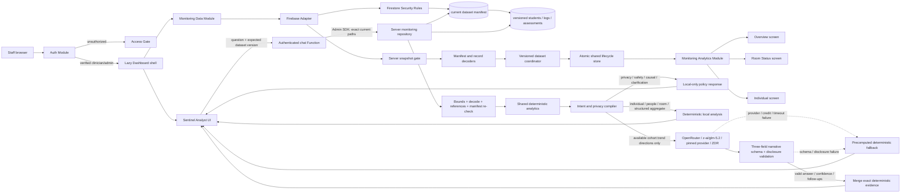

# Architecture

## System map

The composition direction is one-way. Screens know the analytics Interface,
not Firestore. Browser snapshots must pass through Security Rules, server
snapshot verification, decoding, and lifecycle state before they reach screen
analytics. Chat uses an independent privileged server read: its Admin SDK
repository bypasses Security Rules and must preserve equivalent exact-path,
bounded-read, decoding, referential-integrity, and manifest-version invariants
before the disclosure compiler can run.

## Design vocabulary

- **Module** — a cohesive owner of behavior and invariants. The main Modules
  are authorization, monitoring data, monitoring analytics, and each workflow
  screen.
- **Interface** — the small public surface used by the next layer. Examples are
  `useMonitoringData()` and `createMonitoringAnalytics(...).getOverview(...)`.
- **Seam** — a deliberate substitution point. The monitoring store accepts an
  Adapter, so tests can use the in-memory implementation without Firebase.
- **Adapter** — infrastructure translation at a boundary. The Firebase Adapter
  turns a verified manifest and bounded Firestore snapshots into one versioned
  dataset event.
- **Depth** — substantial behavior behind a small Interface. Validation,
  lifecycle, truncation, freshness, error handling, and cleanup stay behind the
  data Module rather than leaking into React.
- **Locality** — code and state live with the workflow that changes them.
  Gender, date, and selected-student state belong to their respective screens.
- **Leverage** — one invariant protects multiple consumers. Central decoding
  and analytics rules protect all three screens and their future variants.

## Runtime boundaries

### Authorization Module

`App.jsx` observes Firebase ID-token changes. Until the token is verified and
contains an allowed `sentinelRole`, only the access gate is rendered. The
dashboard and Firestore code are loaded lazily after authorization.

Firebase configuration has no repository fallback. Vite and the runtime both
validate required values. The actual Vite development-server command is forced
onto fixed localhost Auth and Firestore emulators; freely selectable mode names
are not trusted for this decision. ConfigEnv `command` and `isPreview` form the
classification Seam, while every remote mode requires App Check configuration.
Auth is initialized with browser-session persistence rather than the Firebase
web default, so a privileged sign-in is not retained after its tab or browser
session closes.

Client-side authorization improves UX but is not trusted. `firestore.rules`
repeats the role and verified-email check and denies all client writes.

### Monitoring Data Module

`useMonitoringData()` subscribes to a single shared store. On the first
subscriber the store connects the Firebase Adapter; on the last unsubscribe it
disconnects every listener and clears sensitive records from its snapshot.

The Adapter first reads the exact `monitoringManifests/current` document. Its
safe version selects `students`, `logs`, and `assessments` collections below
`monitoringDatasets/{version}`. Security Rules allow only that current version,
so staged, retired, top-level legacy, and undeclared paths fail closed.

Each selected collection has a hard query limit plus one sentinel record. If
the sentinel appears, the stream is marked truncated. Snapshot records are
decoded using strict types, safe identifiers, valid dates, known score ranges,
and known fields. Any issue moves the public state to `degraded`; stream
failures move it to `error`. Both states pause presentation of analytics.

After all three streams load, the data Module checks referential integrity.
Every log and assessment must reference a student in the same dataset; orphan
records degrade the complete dataset rather than disappearing inside analytics.

The Firebase Adapter requests metadata events and accepts only manifest and
record snapshots whose `fromCache` and `hasPendingWrites` values are explicitly
`false`. Cache-only snapshots and latency-compensated local-write overlays are
neither decoded nor timestamped. Every listener must receive its first
committed server-confirmed snapshot within 15 seconds; otherwise the state
fails closed. A later unverified transition immediately moves the state to
`error`, and a subsequent identical committed snapshot can recover it.

The versioned dataset coordinator buffers all three streams behind a narrow
Interface. It publishes one atomic replacement only after the complete version
is verified. A manifest transition clears the previous sensitive version while
the next one connects. A changed snapshot under an already-published version
violates the immutable-version contract and fails closed until a manifest
transition. This Module has high Depth: independent listeners, generation
tokens, mutation detection, and recovery remain behind one dataset event.

`lastUpdatedAt` is the time the complete dataset was published after all three
streams were server-confirmed. It is point-in-time evidence, not an independent
connection heartbeat and not the age of the underlying clinical observations.
The in-memory Adapter, coordinator, and verified subscriptions are test Seams
for lifecycle behavior with strong Locality and reusable Leverage.

### Monitoring Analytics Module

`createMonitoringAnalytics()` owns all domain transformations:

- deterministic duplicate resolution;
- per-student chronological LOCF for labeled presentation continuity only;
- observed-value population statistics and latest-observation alerts;
- an explicit local-date as-of cutoff that withholds future-dated logs;
- equally weighted per-student weekly means with per-metric sample size and
  sample standard deviation only when at least two students contribute;
- scheduled DASS-21, CD-RISC, and GRIT projections;
- per-instrument latest selection with the source week retained;
- historical room views that never use a future assessment;
- individual interpretation labels.

It returns projections rather than raw storage queries. Screens do not
reimplement domain rules.

### Workflow screens

Overview, Room Status, and Individual are independent Modules with local state.
Recharts and each screen are dynamically imported. Hovering or focusing a
navigation item preloads that workflow, while initial unauthenticated users do
not download Firestore or chart code.

Screen error boundaries replace failed output with a generic safe message and
never reflect exception details into the rendered UI. React root handlers log
only a fixed failure category, never the exception or component stack.
Room and individual workflows label every carried-forward Buddy or Command
value with its source date so presentation continuity cannot be mistaken for a
new observation.

### Sentinel Analyst Module

The authorized dashboard lazily loads the floating assistant. The browser sends
the same-origin `/api/chat` Function only the current question and the exact
dataset version currently displayed. It does not construct or submit an AI
context, raw Firestore records, or prior assistant turns. The Function repeats
verified-email, exact-role, and App Check authorization and rejects unknown body
fields or a stale browser dataset version.

The server monitoring repository reads `monitoringManifests/current` with the
Admin SDK, loads only the three known streams with limit-plus-one sentinels,
decodes each document, checks every log and assessment reference, and reads the
manifest again before publishing an immutable in-memory dataset. Because Admin
SDK reads bypass Firestore Security Rules, this repository and least-privilege
IAM form a separate privileged boundary. Its decoded dataset uses the same pure
domain implementation as browser analytics.

The privacy compiler performs deterministic intent, metric, negation, week
range, top-K, and entity resolution. It has three primary outcomes:

1. Restricted prompt, diagnosis, causal-evidence, unresolved-reference,
   over-broad, and unclear requests return a fixed local-only policy response.
2. Every individual, people-ranking, room, coverage, latest-value,
   week-comparison, forecast, chart, and table request returns a deterministic
   derived response from the Function. An explicit-metric overview and any
   population smaller than the minimum cohort size also stay on this route.
3. Only a broad summary narrative over the eligible multi-metric population
   overview with at least one usable cohort trend can call OpenRouter. The
   Function sends a canonical task instead of forwarding the raw question
   verbatim. The model facts contain only qualitative directions for metrics
   with usable trends. They contain no exact score, count, date, student or room
   identifier, alert status, missing-data status, drawing note, or demographic
   narrative. The complete dynamic outbound packet is limited to 1,536 UTF-8
   bytes.

The first two outcomes execute as deterministic JavaScript inside the
authenticated Firebase Function; they do not require an AI model on the user's
computer and do not call OpenRouter. The third outcome still sends potentially
sensitive qualitative aggregate information outside Firebase. OpenRouter and
the configured provider process those qualitative directions. The Function
pins the model to `z-ai/glm-5.2`, requires one exact approved provider, disables
OpenRouter provider fallback, requires strict structured-output parameters,
and sends `data_collection: "deny"` plus `zdr: true`. If no exact provider is
configured, the request fails closed to the deterministic application
fallback. These routing controls reduce disclosure and retention but do not
create a no-egress system.

Before the broad aggregate call, the Function prepares a deterministic overview
payload. It returns that payload when the API key or configuration is
unavailable, provider capacity or credit fails, the request times out, or model
schema/disclosure validation fails. This application-layer fallback is
different from provider fallback, which remains disabled. A fallback may be
selected after an external request was already attempted, so it is not evidence
of zero egress; response privacy metadata records that distinction.

Prediction requests use a deterministic, bounded ordinary-least-squares trend
computed and rendered on the server and remain exploratory decision support
rather than diagnosis. The provider output limit is 800 tokens and its strict
schema has only `answer`, `confidence`, and `followUps`; digits and undisclosed
entity tokens fail validation. After validation, the Function merges exact
deterministic highlights, data coverage, and method note into the UI payload.
Exact scores, counts, and dates therefore remain server-side even when the
narrative answer is model-backed. Chat history remains only in React memory and
is not resent to the model; it is cleared on sign-out or page close.

## Dependency rules

1. `auth/` may depend on Firebase Auth and shared config, never Firestore.
2. `data/` may depend on decoders and an infrastructure Adapter, never screens.
3. The canonical modules in `functions/domain/` stay framework- and
   Firebase-free; browser-facing `src/domain/` entry points re-export them so
   browser and server analytics cannot silently diverge.
4. `screens/` consume the analytics Interface and loading state, never raw
   snapshots or Firebase SDKs.
5. `App.jsx` is the authorization composition root; `Dashboard.jsx` is the
   authorized workflow composition root.
6. Browser `chat/` sends only the question and expected dataset version. The
   server Function owns provider credentials, server retrieval, privacy
   compilation, outbound disclosure enforcement, and output hydration.

These rules preserve Depth and Locality. New data sources should implement the
Adapter Seam; new presentation variants should consume existing analytics
projections or extend that Module with a tested domain operation.

## Decision records

- [ADR 0001: privileged read-only access](adr/0001-privileged-read-only-access.md)
- [ADR 0002: validate at the data boundary](adr/0002-validate-at-data-boundary.md)
- [ADR 0003: bounded shared data lifecycle](adr/0003-bounded-shared-data-lifecycle.md)
- [ADR 0004: central monitoring analytics](adr/0004-central-monitoring-analytics.md)
- [ADR 0005: clinical browser data scope](adr/0005-clinical-browser-data-scope.md)
- [ADR 0006: explicit Firebase environments](adr/0006-explicit-firebase-environments.md)
- [ADR 0007: manifest-pinned atomic datasets](adr/0007-manifest-pinned-atomic-datasets.md)
